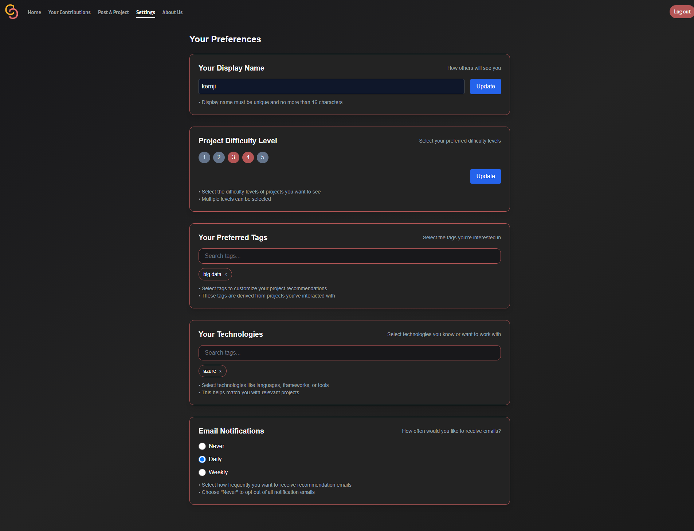
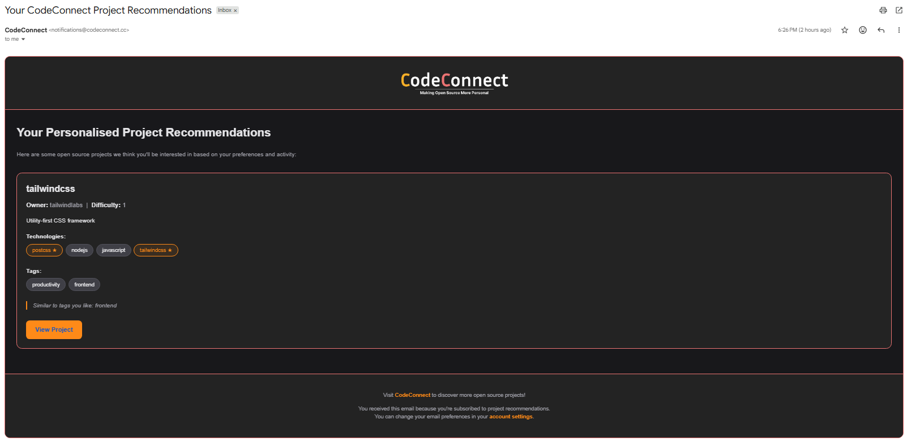

# Code Connect

[Live Project](https://www.codeconnect.cc/) | Built with Next.js, Supabase, and the Sightengine API

Code Connect is a platform that connects open‑source projects with developers through a personalised recommendation system. It helps users discover projects tailored to their interests whilst ensuring a safe and professional environment through content moderation.

---

## ✨ Features

- **Personalised Recommendations**
  - Combines **explicit preferences** (favourited tags) and **implicit preferences** (views, likes).
  - Ranks projects for each user based on behaviour and interests.

- **Content Moderation**
  - Integrated with the [Sightengine API](https://sightengine.com/) to filter profanity, gore, and inappropriate content in images and text.
  - Ensures projects remain safe and professional.

- **Smart Tagging**
  - Auto‑extracts tags from project READMEs using **Levenshtein distance + N‑gram parsing**.
  - Deduplicates and normalises tags for consistency.
  - Users can also manually add tags.

- **Authentication & Access Control**
  - Secure sign‑up and login system.
  - Middleware protects certain routes, redirecting unauthenticated users to log in.

- **Discovery & Browsing**
  - Homepage highlights **Newest**, **Trending**, **Popular**, and **Recommended for You** projects.
  - Advanced filtering by tags, contribution type, and more.

- **Real‑time Updates**
  - Projects can register **GitHub webhooks** to keep stars, activity, and descriptions up to date automatically.

- **Email Digests**
  - Automated **cron jobs** send users a digest of fresh recommended projects.
  - Frequency can be set to **daily** or **weekly**, enabling more passive discovery via email.

- **Scalability**
  - Efficient Supabase queries designed for performance and growth.

---

## 🛠 Tech Stack

- **Frontend:** Next.js / React  
- **Backend & Database:** Supabase  
- **Content Moderation:** [Sightengine API](https://sightengine.com/)  
- **Quality Assurance:** Manual QA workflows (tested authentication, project submission, filtering, recommendation logic, and moderation)  
- **Deployment:** Vercel  
- **Real‑time Sync:** GitHub Webhooks for live project updates  
- **Email Scheduling:** Cron jobs for daily/weekly digests  

---

## 📸 Screenshots

- **Homepage (Overview of Newest & Trending Projects)**  
  

- **Newest Projects with Advanced Filtering**  
  Demonstrates the filtering panel in action on the *Newest Projects* page.  
  

- **Project Submission with Auto‑Tagging**  
  Example of adding a new project, with tags automatically extracted and suggested.  
  

- **User Settings & Preferences**  
  Where users manage their account, notification frequency, and recommendation preferences.  
  

- **Email Digest Example**  
  A sample of the daily/weekly email digest that delivers fresh recommended projects directly to the user’s inbox.  
  

---

## 🎨 Design

- Initial wireframes and UI flows were created in Figma, you can view these [here](https://www.figma.com/design/VP9V3LUwC74ygcgrpliiCf/CodeConnect-Draft?node-id=0-1&p=f&t=JrLnyECxDiJtMtXA-0).  
- These designs guided the layout, colour choices, and user experience implemented in the final build.

---

## 📂 Project Structure (Simplified)

- **middleware.ts** – Next.js middleware for authentication and onboarding  
- **Configuration files** – Next.js, Tailwind, TypeScript, Vercel, etc.  
- **public/** – Static assets (images, icons, sitemaps, robots.txt)  
- **pages/** – API routes and serverless functions (auth, cron, GitHub, projects, webhooks)  
- **services/** – Core service files (e.g. authentication)  
- **src/** – Main application code  
  - **supabaseAdmin.ts / supabaseClient.ts** – Supabase setup  
  - **app/** – Main app pages and layouts  
    - Includes routes like *about, auth, onboarding, projects, trending, recommended*  
    - Shared UI: `globals.css`, `layout.tsx`, `icon.ico`  
  - **components/** – Reusable React components (e.g. NavBar, ProjectPreview, ActivityGraph)  
  - **hooks/** – Custom React hooks (authentication, profanity filter, project filters)  
  - **services/** – App‑specific services (recommendation engine, email scheduler)  
  - **types/** – TypeScript type definitions  
  - **utils/** – Utility functions (API helpers, GitHub integration, token refresh)  

---

## 🌐 Deployment & SEO
- Deployed on Vercel with the custom domain [codeconnect.cc](https://www.codeconnect.cc/).  
- Configured with sitemap and robots.txt to improve Google search rankings and discoverability.  

---

## 📌 Notes
- Some project entries are seeded examples for demonstration purposes.  
- Real projects can be added by users via GitHub integration and webhooks, so details may differ from live repositories.  
- The email digest feature is fully implemented, but the scheduled cron job is currently disabled to avoid unnecessary costs.  

- This project is not intended to be run locally without configuration.  
- It relies on multiple environment variables (e.g. Supabase keys, API tokens, webhook secrets) that are not included in the repository for security reasons.

---

## 👤 Author

Independently designed, developed, and deployed by **Kenji Berry**.
